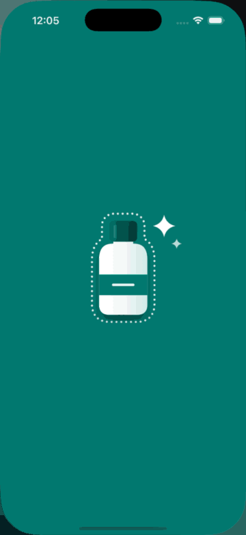

# CleanCut

**An on-device product-photo studio for iOS.** Pick or shoot a product photo. CleanCut removes the background, places the product on a clean studio backdrop with a natural shadow, and exports it at the right size for Depop, Vinted or Amazon. Nothing leaves the device.

[](https://github.com/sohrabgit/CleanCut/actions/workflows/ci.yml)
  

<p align="center">
  
</p>

<!-- Recorded in the iPhone Simulator with `make demo`; guided capture runs on its replay camera there. -->

## What this demonstrates

| | |
|---|---|
| **Core Image** | A pure pipeline `Pipeline.makeImage(inputs, recipe, size) → CIImage`: framing in output space, feathering, drop and contact shadows built from the mask, studio backdrops. Tests prove the preview and the export match. → [`Pipeline/`](Kit/CleanCutKit/Pipeline) |
| **Metal** | A custom `CIColorKernel` that removes backdrop color from soft edges by solving the compositing equation. The live preview is an `MTKView` drawn through a Metal-backed `CIContext`, measured in the worst case at ≤ 5 ms per 1206² frame on an M4 Max and 15.6 ms (p90) per 750² frame on an iPhone SE (A13); the 60 Hz budget is 16.7 ms. → [`EdgeDecontamination.metal`](Kit/CleanCutKit/Kernels/EdgeDecontamination.metal), [`CanvasView.swift`](App/Features/Editor/CanvasView.swift) |
| **Vision & Core ML** | Vision foreground *instance* masks with tap-to-select. Open-source models (U²-Netp, ISNet; Apache-2.0) are converted reproducibly and benchmarked across CPU / GPU / Neural Engine. → [BENCHMARKS.md](docs/BENCHMARKS.md) |
| **Swift concurrency** | Swift 6 strict concurrency with warnings as errors. The app is `MainActor` by default and heavy work runs `@concurrent`. Batch mode is a bounded sliding-window `TaskGroup` streaming progress as an `AsyncStream`. The camera is an actor on its own capture queue. → [`BatchProcessor.swift`](Kit/CleanCutKit/Batch/BatchProcessor.swift), [`CameraEngine.swift`](App/Features/Capture/CameraEngine.swift) |
| **AVFoundation & real-time analysis** | Guided capture checks every frame before the shutter: two custom Core Image kernels (a Laplacian for sharpness, a tone pass for clipping and glare) weighted by a live U²-Netp subject mask, reduced on the GPU to eight floats per frame, with a coach that holds each verdict before changing a tip. A generated replay scene stands in for the camera in the Simulator, and tests stage every tip through the real analyzer. → [`Capture/`](Kit/CleanCutKit/Capture), [DECISIONS 010](docs/DECISIONS.md) |
| **Performance work** | I measured and fixed batch memory: a long-lived `CIContext` peaked at 2.9 GB, a context per photo stays flat at ~0.9 GB. ImageIO downsamples during decode, and the preview runs on cached proxies. → [DECISIONS 006](docs/DECISIONS.md) |
| **Product & UX** | A clean, native UI: the photo is the hero and there's one primary action per screen. Every change is live and can be undone. Haptics, VoiceOver, Dynamic Type, Dark Mode, and an iPad/Mac inspector layout. → [SPEC.md](docs/SPEC.md#uiux) |
| **Testing** | 98 Swift Testing tests that run natively on macOS in ~3 s and on the iOS Simulator, a UI flow test that exports screenshots, and CI. |

## Features

- **Guided capture.** Take Photo opens a camera that coaches before you shoot: it finds the product and checks that it's whole and big enough in the frame, lit without blown highlights, sharp, and free of glare. One tip at a time, and a shutter ring that turns teal when the shot is ready. It never blocks the shutter.
- **Remove the background.** Vision finds each object. Tap an object to include or exclude it, and a near miss still snaps to the nearest one. U²-Netp (Core ML) is the fallback where Vision can't run; its mask is split into separate objects, so tapping still works.
- **Studio look.** White, paper, sand and other swatches, a studio sweep, a custom color, or transparent. Shadows are None / Soft / Contact / Natural, with intensity, direction, distance and softness.
- **Clean edges.** A custom Metal kernel removes the old background's color from hair-thin edges (a green halo from a lawn, a warm fringe from a table).
- **Marketplace formats.** Depop 1:1, Vinted 4:5, Amazon main image (2000 px, pure white, 85% fill), and a transparent PNG cutout. The subject is auto-cropped and centered. Presets live in [one table](Kit/CleanCutKit/Recipe/ExportPreset.swift).
- **Live preview.** WYSIWYG in the selected format: press and hold to compare, pinch to inspect edges, undo/redo, and a "lift" reveal when the cutout appears.
- **Export.** Full-quality renders to Photos (add-only permission) or the share sheet, several formats at once.
- **Batch edit.** Apply your last style to up to 50 photos, with a live progress grid, cancel and retry.

## How it works

```
photo ──ImageIO (≤4096 px)──► Vision / Core ML ──► soft mask + instance labels
                                                        │
Recipe (Codable value) ──► Pipeline.makeImage ◄─────────┘
   background · shadow · edges · preset
                    │  1 framing → output space   2 feather   3 edge kernel
                    │  4 shadows from mask        5 backdrop  → CIImage (lazy)
                    ▼
     MTKView preview (proxy, on demand)   ·   export (working image)   ·   batch
```

- **A `Recipe` is a value.** Undo is a stack of values, batch mode applies one recipe to 50 photos, and the last style is remembered as JSON.
- **Every length in the recipe is relative to the subject.** So the 320 px preview and the 2000 px export look identical: *PSNR > 32 dB* in `previewAndExportLookTheSame`.
- **Masks are treated as data, not color**: they're never color-managed. That, plus exact sRGB output, is why Amazon's white measures exactly `(255, 255, 255)`, and the tests check it.

Details: [ARCHITECTURE.md](docs/ARCHITECTURE.md) · trade-offs: [DECISIONS.md](docs/DECISIONS.md) · product and UX spec: [SPEC.md](docs/SPEC.md).

## Benchmarks

**On an iPhone SE (2nd generation, A13 Bionic, iOS 26.6.2)**, measured in the app (Settings › Benchmarks):

| | p50 | p90 |
|---|---|---|
| Vision instance mask (automatic placement) | **53.6 ms** | 54.6 ms |
| U²-Netp on CPU + Neural Engine (`.all`: 35.8 ms) | **22.1 ms** | 24.2 ms |
| Preview frame, ordinary edit (750², 60 Hz budget 16.7 ms) | 2.6–8.4 ms | 3.1–8.6 ms |
| Preview frame, worst case (everything recomputes) | 14.5 ms | 15.6 ms |
| Guided capture analysis per frame (15 fps budget 66.7 ms) | **13.0 ms** (mean 22.5 ms) | 44.9 ms |

**On an Apple M4 Max (macOS 26)**, measured with the `cleancut-bench` CLI:

| Engine | Best compute units | Size | Inference p50 | CPU only | `.all` | IoU vs Vision |
|---|---|---|---|---|---|---|
| Vision (instance mask) | Neural Engine | system | **15.0 ms** | unsupported | – | ref. |
| U²-Netp 320² | CPU + Neural Engine | 2.4 MB | **4.6 ms** | 16.9 ms | 7.5 ms | 0.958 |
| ISNet 1024² fp16 | CPU + Neural Engine | 84 MB | **25.1 ms** | 103 ms | 38.7 ms | 0.956 |
| ISNet 1024², 6-bit palettized | CPU + Neural Engine | 32 MB | **24.2 ms** | 103 ms | 37.5 ms | 0.955 |

What stood out:
- Pinning compute units beats `.all`.
- 6-bit palettization makes the file 2.6× smaller at no measurable cost.
- The first Neural Engine load of ISNet compiles on device for 8–9 s. The OS then caches it by model location, and later loads take about 30 ms.

Full tables, method and caveats: [BENCHMARKS.md](docs/BENCHMARKS.md). The Mac CLI and the in-app screen run the same harnesses from `CleanCutKit/Bench`.

**Preview (M4 Max):** 0.5 ms per frame for a redraw, 1.5–1.9 ms while dragging a shadow or edge slider, and 4.2 ms (p90 5.1 ms) in the worst case where everything recomputes. Measured at 1206×1206.

**Batch:** 50 × 12 MP photos take 1.8 s with 4 workers. Peak footprint is 0.87 GB with 1 worker and 1.4 GB with 4, and the footprint between photos stays flat.

## Build and run

Requires Xcode 26, iOS 18+ and Swift 6.

```sh
brew install xcodegen
make generate      # CleanCut.xcodeproj from project.yml
make test          # CleanCutKit tests, natively on macOS (~3 s)
open CleanCut.xcodeproj
```

- **Simulator.** Vision's instance mask can't run there ("Could not create inference context"). CleanCut falls back to U²-Netp for your own photos, and to precomputed masks for bundled samples.
- **Mac.** Run the app natively as *My Mac (Designed for iPad)* to use real Vision and the Neural Engine. Copy `Configs/Local.xcconfig.example` to `Configs/Local.xcconfig` and set your team.

| Command | What it does |
|---|---|
| `make test` / `make test-ios` | Kit tests on macOS / iOS Simulator |
| `make screenshots` | UI flow test in the Simulator, screenshots to `.build/screenshots` |
| `make bench` | Builds `cleancut-bench` (`render`, `sample`, `batch`, `segment`, `memprobe`) |
| `make -C Tools/ModelConversion` | Converts U²-Netp and ISNet to Core ML (pinned Python env via `uv`) |
| `make demo` | Records the demo GIF from the Simulator |

## Project layout

```
App/                     SwiftUI app: Home, Capture, Editor (canvas, tools), Export, Batch, Settings, DesignSystem
Kit/CleanCutKit/         Recipe, Pipeline, Kernels (Metal), Capture, Segmentation, Rendering, Batch, Bench
Tests/CleanCutKitTests/  Swift Testing suite (+ synthetic scenes)
UITests/                 End-to-end flow, screenshots, demo recording
Tools/bench/             macOS CLI: render, sample, batch, segment, memprobe
Tools/ModelConversion/   PyTorch → Core ML conversion (U²-Netp, ISNet)
Models/                  U2Netp.mlpackage (+ generated ISNet variants, git-ignored)
docs/                    SPEC, ARCHITECTURE, DECISIONS, BENCHMARKS
```

## What I'd do next

- **More chips.** Run Settings › Benchmarks on a recent iPhone (A17/A18) next to the A13, and cut the worst-case preview frame on older phones (a lower-resolution matte while a slider moves).
- **Prewarm the model.** Load the Core ML model in the background on first launch to absorb the one-time Neural Engine compile.
- **Better matting.** Guided-filter refinement of the Core ML masks (they're upsampled from 320²), and a multi-level foreground estimate for the edge kernel.
- **Tune guided capture on real photos.** Calibrate the thresholds on a labeled set of real product shots instead of generated scenes. Its per-frame cost on an iPhone SE is measured (22.5 ms mean at a 66.7 ms budget).
- **Fidelity check.** OCR before and after to flag product labels the mask clipped.
- **Templates.** Share `Recipe` JSON between sellers ("shop style").

## License

MIT for the code (see [LICENSE](LICENSE)). The bundled U²-Netp model is Apache-2.0 (see [THIRD_PARTY_NOTICES.md](THIRD_PARTY_NOTICES.md)).
