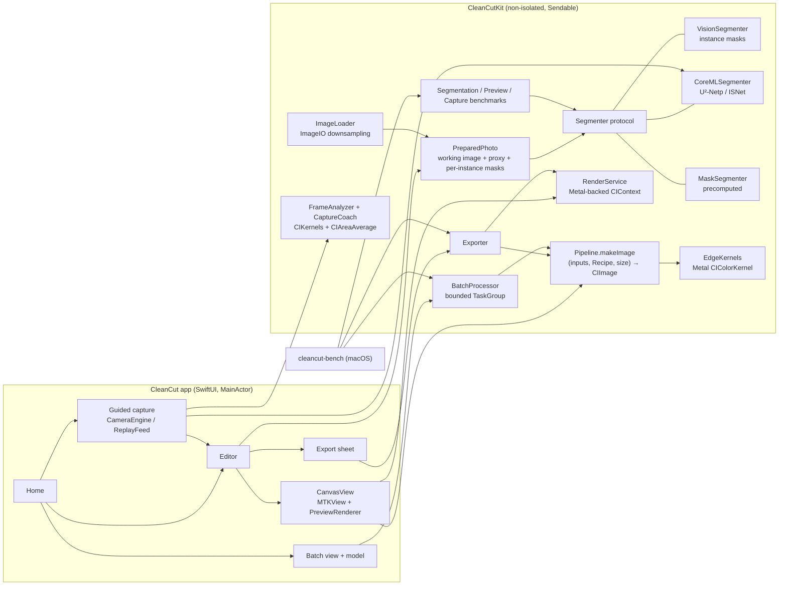
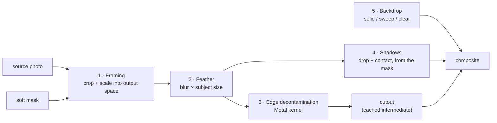

# Architecture

CleanCut is two layers. The layer boundary is also the concurrency boundary.

- **`CleanCutKit`** is a framework for iOS 18 and macOS 15. It holds all imaging, segmentation, batch and benchmark code. It has no UI dependency, and it's non-isolated: `Sendable` values and services.
- **`CleanCut`** is a SwiftUI app. Its default actor isolation is `MainActor`, and it owns state, gestures and presentation.

## The image pipeline

`Pipeline.makeImage(_ inputs: PipelineInputs, recipe: Recipe, outputSize: CGSize) -> CIImage` is a pure function. It only *describes* a Core Image graph, and nothing renders until a `CIContext` draws it. The live preview, the export sheet, the batch processor and the tests all call it.

1. **Framing first.** `Framing.canvasRect` picks the smallest canvas with the preset's aspect ratio in which the subject fills exactly `fill` of the width or height. Source and mask are resampled straight into output space. From here on, everything costs *output* pixels, not camera pixels. A 48 MP photo exported at 2000 px never blurs 48 MP.
2. **Relative units.** Every length in a `Recipe` is a fraction of the subject's short side (`unit`). The same recipe therefore produces the same look at 320 px and at 2000 px, and a parity test proves it.
3. **Edge decontamination** (`EdgeDecontamination.metal`). Soft edge pixels are a mix of product and old backdrop: `I = αF + (1−α)B`. The kernel estimates the local backdrop color `B` from a blur of the background-only pixels, weighted by `(1−α)⁴` so that half-mixed pixels don't pollute the estimate. It then solves for `F`. Interior pixels (α = 1) are unchanged by construction.
4. **Shadows** come from the matte. The drop shadow is the silhouette, offset along the light direction and blurred. The contact shadow is the bottom 12% of the silhouette, flattened onto the floor plane, as a tight core plus a wider ambient falloff.
5. **Backdrop.** Solid colors are exact sRGB, so the Amazon preset's white is exactly 255. The studio sweep is a vertical gradient plus a soft vignette. Transparent renders to PNG.

**Masks are data, not color.** Every mask is created with `.colorSpace: NSNull()` and rendered with `colorSpace: nil`, so coverage values never get gamma-converted. `Matte.canonical` normalizes any mask to opaque `(v, v, v, 1)` over the infinite plane, which makes blurs well defined at image edges.

## Live preview

- `PreparedPhoto` builds a **proxy** once: the source at ≤ 1600 px and one mask per instance, each rendered to a bitmap. A frame never re-decodes, re-segments or re-samples the full-size image. Toggling an object is just a different per-pixel maximum of cached masks.
- `CanvasView` wraps an `MTKView` (`framebufferOnly = false`) and `PreviewRenderer` draws through `CIRenderDestination` with the shared Metal command queue.
- It redraws **on demand** (`enableSetNeedsDisplay`) when the `CanvasScene` value changes. It runs a display link only while something animates: the lift reveal, or the selection glow in Select mode. The cutout goes through `insertingIntermediate(cache: true)`, so background and format changes don't re-run the kernel.
- Zooming re-renders the pipeline at the magnified size, and Core Image only evaluates what lands in the drawable. Tap-to-select hit-tests with the same `CanvasLayout` math the renderer uses.
- `OSSignposter` intervals and a debug HUD (GPU/CPU ms per frame) are on the canvas. `PreviewBenchmark` times the same kind of frames offline, from the CLI on a Mac and from Settings › Benchmarks on a device.

## Guided capture

The camera coaches before the shutter. Frames flow one way and are dropped, never queued:

1. **Feed.** `CameraEngine` (AVFoundation) or `ReplayFeed` (the Simulator and UI tests, filming the Kit's generated `ReplayScene`) yields upright `CIImage`s, at most 15 per second, through a newest-only `AsyncStream`. A slow consumer drops frames instead of holding camera buffers.
2. **Mask.** Every third frame, `CoreMLSegmenter.liveMask` renders the frame into a pooled 320² buffer inside the model's actor and returns U²-Netp's mask. It skips the label map and object splitting.
3. **Measure.** `FrameAnalyzer` resamples the frame to a 720-px short side and runs two kernels from `CaptureKernels.metal`: a Laplacian for detail and a tone pass for clipped highlights, crushed shadows and specular hotspots. Both are weighted by the mask and reduced with `CIAreaAverage`, then read back as eight floats. The mask's bounding box comes from a ≤128-px readback.
4. **Judge.** `CaptureAssessment` maps the metrics to at most one issue per check (framing, light, sharpness, glare). `CaptureCoach` holds each check for 0.4 s before changing it and picks the tip by check order.

Everything after the feed is shared, and the Kit tests stage every scenario through the real analyzer. See [DECISIONS 010](DECISIONS.md) for the trade-offs.

## Segmentation

`Segmenter` → `SegmentationResult`: a low-res `LabelMap` (for hit-testing and bounding boxes, pure and unit-tested) plus a closure that builds a full-resolution soft mask for any selection.

| Engine | Where | Notes |
|---|---|---|
| `VisionSegmenter` | device, Mac | Foreground *instance* mask; tap to select; full-res guided mask |
| `CoreMLSegmenter` | anywhere, incl. Simulator | U²-Netp (bundled, 2.4 MB) or ISNet; one salient mask, split into its disconnected objects |
| `MaskSegmenter` | tests, samples | Precomputed masks |
| `FallbackSegmenter` | app | Vision, then U²-Netp only on `.unavailable`; real failures surface |

## Concurrency

- **Swift 6** language mode with warnings as errors.
- The app uses `MainActor` by default. Heavy work is marked `@concurrent` (decode, thumbnails, export rendering) or lives in the Kit.
- `CIContext`, `CIImage`, `MTLDevice` and Vision's observations are `Sendable`. `MLModel` isn't, so `CoreMLSegmenter` keeps it inside an actor.
- `CameraEngine` is an actor whose executor is its own `DispatchSerialQueue`, the queue the video output delivers on. Session configuration and `startRunning()` block, and would otherwise tie up a thread of the cooperative pool. `AVCaptureSession` isn't `Sendable`; the preview layer is its only use outside the actor (`PreviewSession`).
- `BatchProcessor` uses a sliding window over a task group: at most N photos in flight. Progress arrives as an `AsyncStream`, and dropping the stream cancels the work.

## Memory

- ImageIO decodes straight to the needed size (4096 px for the editor, 3072 px for batch).
- The preview uses bitmap-backed proxies.
- **Each photo or editing session gets its own short-lived `CIContext`.** A long-lived one accumulated ~1.5 GB across photos (see [DECISIONS 006](DECISIONS.md)).

## Testing

`CleanCutKitTests` uses Swift Testing and runs natively on macOS in about 3 s, and also on the iOS Simulator. It covers:
- pure geometry
- pipeline invariants on synthetic "contaminated" scenes
- the Metal kernel
- segmentation, batching and concurrency limits
- Core ML against ground truth
- Vision integration (Mac/device only)

`CleanCutUITests` drives the real app flow and exports screenshots (`make screenshots`).
